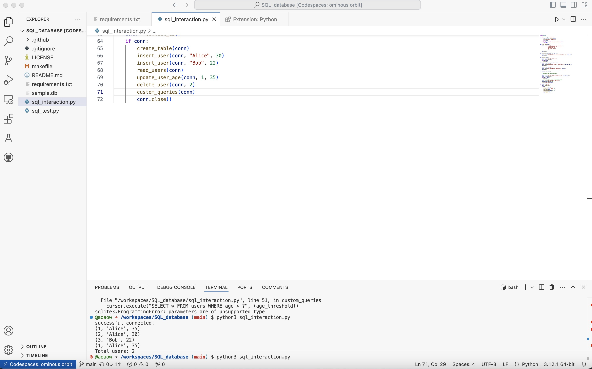

# SQLite CRUD Operations Project

[](https://github.com/aoaow/sqlite_crud_project/actions/workflows/main.yml)

## Overview
This project is a Python script that demonstrates CRUD (Create, Read, Update, Delete) operations on an SQLite database. The script includes functions to connect to the database, create a table, insert data, read data, update records, and delete records, along with custom SQL queries. Additionally, unit tests are provided to ensure the functionality of the `sql_interaction.py`.

## Week 6 Update
In week 6, I updated a complex query in file `complex_sql_query.py`. This query would connect to the databricks remote database `my_database`, which contains 2 tables: employess and departments. In the emloyee table, you would expect employees in different department with their salaries. In the department table, you would expect it contains department name corresponding to the id. The query woulf find out the total salaries by different departments and rank them descendingly. I also include a test file `test_complex_sql_query.py`

## Features
- Connect to an SQLite database
- Create a `users` table
- Insert, read, update, and delete user records
- Execute custom SQL queries
- Unit tests for verifying `read_users` functionality

## Installation
1. Clone the repository:
   ```bash
   git clone <https://github.com/aoaow/sqlite_crud_project>
   ```
2. Navigate to the project directory:
   ```bash
   cd sqlite_crud_project
   ```
3. Install the required dependencies:
   ```bash
   pip install -r requirements.txt
   ```

## Usage
To run the script:
```bash
python3 sql_interaction.py
```
This will connect to the SQLite database and perform CRUD operations.

## Testing
Unit tests are included to verify the functionality. To run the tests:
```bash
python -m unittest sql_test.py
```

## Successful Implementation



## License
This project is licensed under the MIT License.

